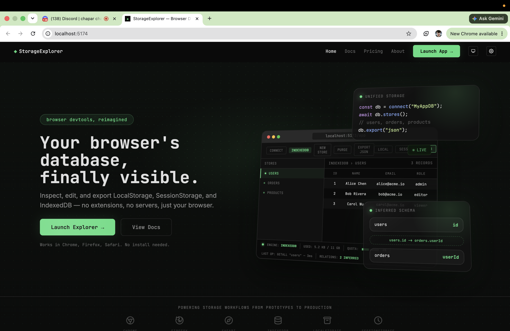
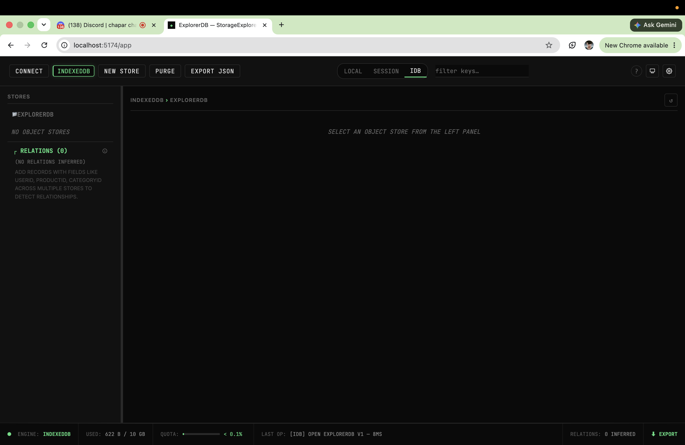
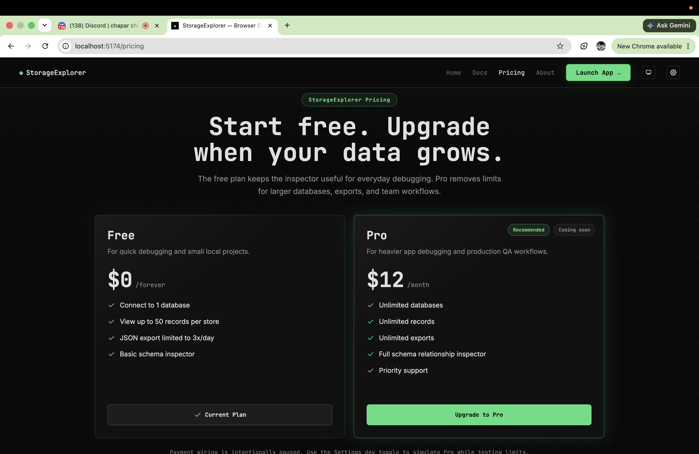
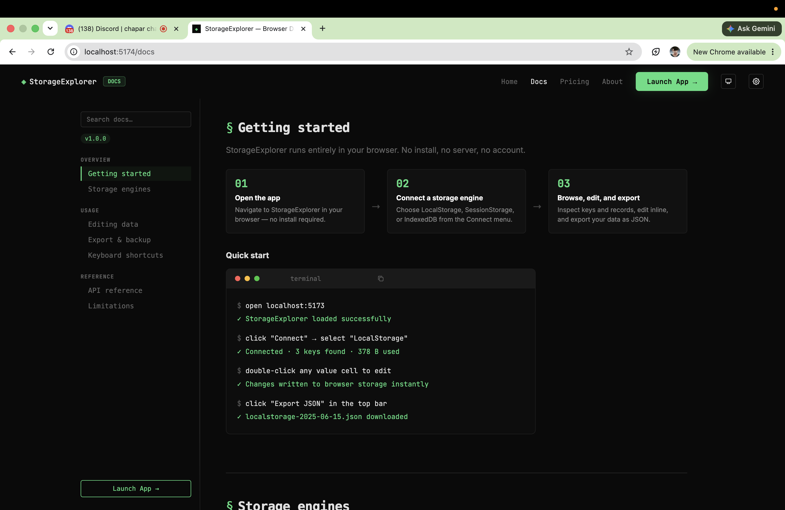
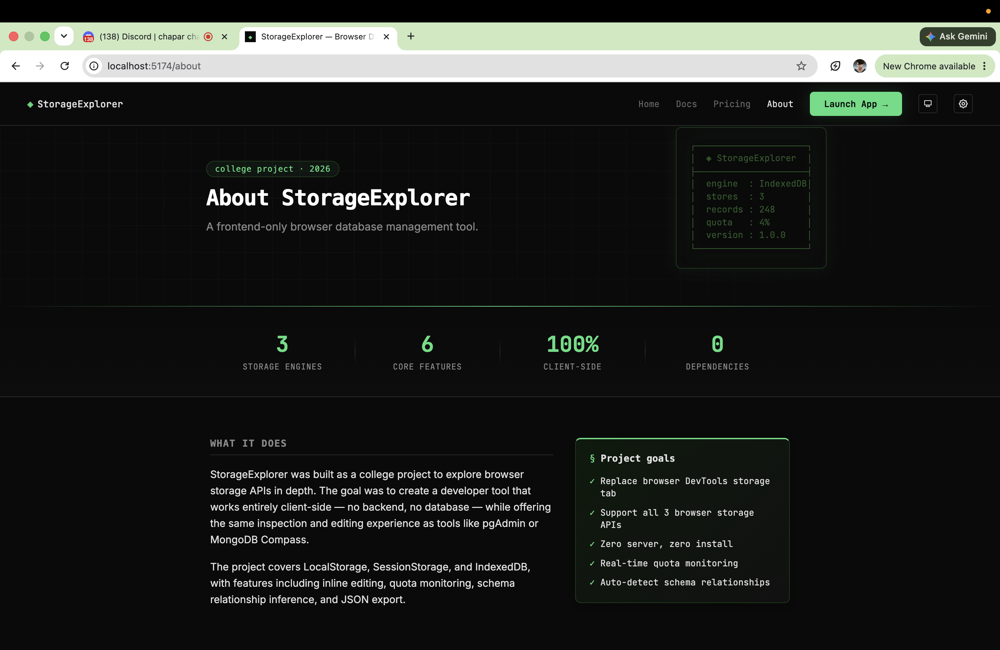

# ◈ StorageExplorer

**Your browser's database, finally visible.**

StorageExplorer is a frontend-only developer tool for inspecting, editing, and exporting browser storage — LocalStorage, SessionStorage, and IndexedDB — from a single unified interface. No extensions, no backend, no install. Everything runs in your browser.

Built as a college project at **ITM University** (2026).

---

## Screenshots

### Landing page


### Explorer workspace


### Pricing page


### Documentation page


### About page


---

## Features

### Unified storage explorer
- Switch between **LocalStorage**, **SessionStorage**, and **IndexedDB** from one workspace
- Live table view with key/value browsing and inline filtering
- Double-click to edit cells — changes write directly to real browser storage

### IndexedDB admin
- Connect to any database by name and version
- Object store tree navigator with record counts
- Create stores, purge data, delete stores, or delete entire databases
- Promisified `IDBWrapper` for clean async operations

### Schema relationship inspector
- Auto-detects foreign key relationships across object stores
- Visual relationship graph in the HUD
- Highlights related stores when a relationship is selected

### Quota monitoring
- Real-time storage usage in the bottom telemetry HUD
- UTF-16 byte estimation for Local/Session storage (~5 MB limit)
- `navigator.storage.estimate()` for IndexedDB and origin-wide usage
- Color-coded progress bar (green → amber → red) with breakdown tooltip

### Export & backup
- Export any engine as structured JSON
- Configurable format: minified or pretty-printed (2/4 spaces)
- Optional metadata wrapper (`exportedAt`, `engine`, `recordCount`)
- Custom filename templates: `{engine}`, `{date}`, `{dbName}`, `{storeName}`

### Developer experience
- Dark / light / system theme with persistent settings
- Customizable layout (panel width, HUD height, font size)
- Workspace memory — restores last engine, database, and open store on reload
- Global keyboard shortcuts (`Ctrl+1/2/3`, `Ctrl+E`, `Ctrl+R`, `?`, and more)
- First-run onboarding walkthrough
- Built-in docs, settings, and about pages

---

## Tech stack

| Layer | Technology |
|-------|------------|
| UI | React 19 |
| Routing | React Router 7 |
| State | Zustand |
| Build | Vite 8 |
| Styling | CSS (custom design system) |
| Icons | Tabler Icons |
| Font | JetBrains Mono |

**Zero runtime dependencies beyond React ecosystem** — no UI framework, no database server.

---

## Getting started

### Prerequisites

- [Node.js](https://nodejs.org/) 18+ (20+ recommended)
- npm, yarn, or pnpm

### Install & run

```bash
git clone https://github.com/Yuvrajmishra-cell/Storage-Explorer.git
cd Storage-Explorer
npm install
npm run dev
```

Open [http://localhost:5173](http://localhost:5173) in your browser.

### Build for production

```bash
npm run build
npm run preview   # preview the production build locally
```

### Lint

```bash
npm run lint
```

---

## Usage

1. **Launch the app** — click **Launch Explorer** on the landing page or go to `/app`
2. **Connect** — choose LocalStorage, SessionStorage, or IndexedDB (enter a database name for IDB)
3. **Explore** — browse data in the table, filter by key, double-click to edit
4. **Export** — use the **Export** button in the bottom HUD or `Ctrl+E`
5. **Settings** — visit `/settings` to configure theme, layout, export defaults, and more
6. **Docs** — visit `/docs` for API reference and keyboard shortcuts

### Keyboard shortcuts

| Action | Shortcut |
|--------|----------|
| Switch to LocalStorage | `Ctrl+1` |
| Switch to SessionStorage | `Ctrl+2` |
| Switch to IndexedDB | `Ctrl+3` |
| Focus filter input | `Ctrl+F` |
| Export current engine | `Ctrl+E` |
| Refresh current store | `Ctrl+R` |
| Open shortcuts modal | `?` |
| Save inline edit | `Enter` |
| Cancel inline edit | `Escape` |
| Delete selected row | `Delete` |

---

## Project structure

```
storage-explorer/
├── src/
│   ├── components/       # UI pages and app chrome
│   │   ├── LandingPage.jsx
│   │   ├── ExplorerStage.jsx
│   │   ├── StorageConsole.jsx
│   │   ├── StorageTelemetryHUD.jsx
│   │   ├── IdbDataMatrix.jsx
│   │   ├── DatabaseDataMatrixSpreadsheet.jsx
│   │   ├── SchemaObjectTreeNavigator.jsx
│   │   ├── SettingsPage.jsx
│   │   ├── DocsPage.jsx
│   │   └── AboutPage.jsx
│   ├── store/
│   │   └── useStore.js   # Zustand global state
│   ├── utils/
│   │   ├── storage.js    # Read/write + relationship inference
│   │   ├── storageQuota.js
│   │   ├── IDBWrapper.js # Promisified IndexedDB API
│   │   ├── idbAdmin.js   # Database/store deletion
│   │   └── theme.js
│   ├── App.jsx
│   └── main.jsx
├── index.html
├── vite.config.js
└── package.json
```

---

## How it works

StorageExplorer runs entirely client-side. All data stays in your browser — nothing is sent to a server.

- **LocalStorage / SessionStorage** — reads and writes via the Web Storage API; quota is estimated using UTF-16 byte counting against a ~5 MB browser limit
- **IndexedDB** — uses a custom promisified wrapper around the native IDB API; quota comes from `navigator.storage.estimate()`
- **Settings & workspace** — persisted to `localStorage` under `dbExplorerSettings` and `dbExplorer_theme`

---

## Browser support

Works in modern versions of:

- Chrome / Chromium
- Firefox
- Safari

IndexedDB features require a browser with full IndexedDB support. Storage quota APIs depend on `navigator.storage.estimate()` availability.

---

## Author

**Yuvraj Mishra**  
Computer Science Student · ITM University · 2026

- [LinkedIn](https://www.linkedin.com/in/yuvraj-mishra-b4184637a)
- [Email](mailto:yuvrajam9@gmail.com)

---

## Acknowledgments

Inspired by tools like pgAdmin and MongoDB Compass — reimagined for the browser's built-in storage APIs.

If this project helps you debug storage in your apps, consider giving it a ⭐ on GitHub.
